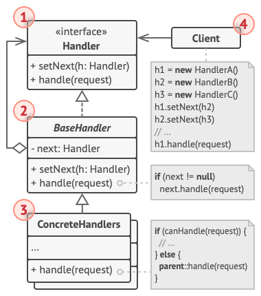

# Chain of Responsibility

Permite que você passe pedidos por uma corrente
de handlers. Ao receber um pedido, cada handler
decide se processa o pedido ou passa para o
próximo handler da chain (corrente).

## Estrutura

