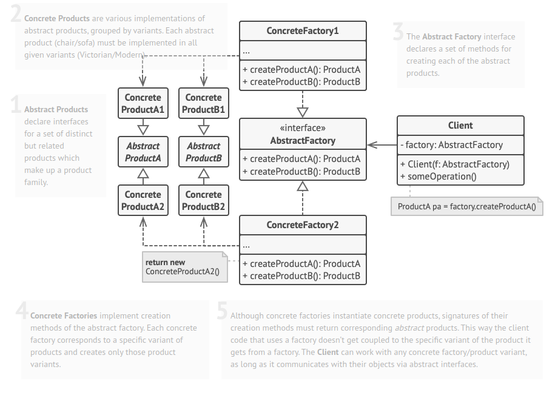

# Padrão de Criação

Objetivo: abstrair o processo de instanciação, ajudando a tornar o sistema independente de como
os objetos são criados, compostos e representados.

- [Abstract Factory](#abstract-factory)

## Abstract Factory

### Objetivo

Fornecer uma interface para criação de famílias de objetos relacionados ou dependentes sem
especificar suas classes concretas.

### Aplicabilidade

Abstract Factory deve ser usado quando:

- um sistema deve ser independente de como seus objetos são criados, compostos ou representados;
- um sistema deve ser configurado como um objeto de uma família de múltiplos objetos;
- uma família de objetos for projetada para ser usada em conjunto, e você necessita garantir
    esta restrição;
- você quer fornecer uma biblioteca de classes e quer revelar somente suas interfaces,
    não suas implementações.

### Estrutura

### Vantagens

- Isola as classes concretas
- Facilita a troca de famílias de objetos
- Promove harmonia entre objetos: quando objetos  numa família são
    projetados para trabalharem juntos, é importante que uma aplicação
    use objetos de somente uma família de cada vez

### Desvantagens

- Dificulta adicionar novos tipos de objetos
